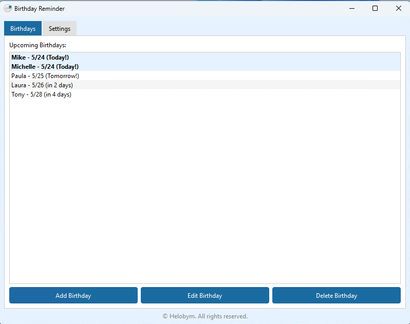
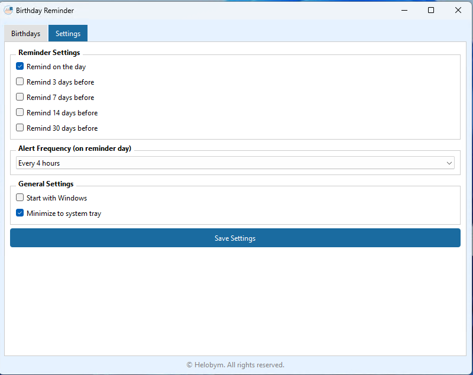

This software is developed by [Helobym](https://helobym.com)

The Birthday Reminder Apps software is designed to help users remember and celebrate the birthdays of their friends, family, and important contacts. By keeping track of upcoming birthdays, the app ensures that users never miss an important date. It allows users to store names and birth dates, and then provides timely reminders as each special day approaches. This way, users can prepare in advance, whether they want to send a message, buy a gift, or plan a celebration. The software aims to make it easy to maintain thoughtful connections and show appreciation for the people who matter most in one’s life.

[Demo Video](https://youtu.be/VX3Yk5m9v60)

